# SkipSort

## What is this?

This is an implementation of an `O(n)` non-comparison based sorting algorithm for large-ish datasets that
I came up with. 

## How Does it Work?

### Linear-Time Sorting
The basic idea is that in order to sort the dataset `X`, you just go through it once and hash the number
by its value into its correct spot using some kind of hash function which only requires `O(1)` time. 

Since all you'd need for such an algorithm is to traverse the set of data just once, you'd be able to
obtain a sorted set in just `O(n)` steps. 

### Sorting by Hashing
A Hash-based sorting function would look something like this:
```cpp
list<int> sort(list<int> unsortedData, int hashFunction*(int)) {
    // create the same length list as unsortedData
    list<int> sortedData(unsortedData.length); 
    
    // sort the unsortedData list
    for(int i = 0; i < unsortedData.length; i++) {
        sortedData[i] = hashFunction(unsortedData[i]);
    }
    
    // return the sortedData
    return sortedData;
   
}
```
While this looks great in theory, in practice it requires far more resources than is reasonable. 
The time it takes to hash the values may be `O(1)`, but to be able to hash all possible values of integers
into the same datastructure, using `D` bits to take into a account for duplicates, would require 
`O(D^(2^(bits)))` of space complexity. For example, to use a hash table for sorting `32-bit` integers 
and using `8-bit` values to count duplicates, you would need `8^(2^32) = 8^4294967296` which 
is an ***ASTRONOMICAL*** amount of space that we can't even begin to comprehend; just for sorting integers.

Even if we *were* somehow able to store that much memory, even in disk memory, the amount of time that would
take to traverse a sparse hash table like that would be directly proportional to the amount of space
we consume. 

### A More Feasible Approach
Methods to bypass this limitation would include using a hash-table which would only instantiate 'bucket'
values (an entry in the hash table representing the specific value and number of times it has appeared) 
only when it needs them, and then creating a link between the new bucket and the already existing
buckets, so that we can just jump to them. This approach is definitely more feasible, 
but when you think about it, it's just an ordered linked list, which would give us a time complexity
of `O(n^2)`, which is about as good as bubble sort.

Amends can be made to this approach however. We could use a technique of 'Folding', where we determine
the average difference between numbers in the set, and make something like `2^(4-i)` steps when entering
the data instead of `1`. This helps but not by quite the amount that we'd need. 


### A Quick Way to Access Data With Step Reductions?
What we need in this case, is a data-structure which would allow us to have a very quick access and
insertion time, but at the same time maintain order. 

If you're reading this and by now your mind isn't screaming *"Skip List!"* I don't know what to tell you.
A skip list has `O(log n)` lookup time, which isn't exactly *optimal*, but when you think about the 
problem at hand, if the data that we're dealing with can contain duplicate entries, AND we want to be
able to sort larger sets of data with very minimal overhead, a skip-list that contains the numeric
value, as well as a counter for the number of times we've seen a number, makes perfect sense.

For example, if we're dealing with lots of `8-bit` integers, the amount that we'll have will likely
be all over the place. And if we're using `8-bit` integers, it might be due to the fact that we need 
lots of them, otherwise space consumption would become a major hassle. If we're dealing with many
of these `byte` values, over `256` to be exact, then we're going to going to probabilistically see
the same values over and over again, and the amount that the skip-list needs to hold would be limited
to just `256`. On average, we would need `log(256) = 8` steps in order to access one of these values, 
and so if `n > 256`, then the amount of steps needed to access all of these in one pass would be 
`Ө(n*log(256))`, or `Ө(n*8) ~= Ө(n)`. 

# The Naive Algorithm 

## Psuedo-Code

The psuedo-code to this algorithm is actually not far off from what I wrote in the first example
of a hash-based approach to sorting. It goes like this:
```cpp
list<int> SkipSort(list<int> unsorted) {

    // Use a skiplist for the insertion and return process
    Skiplist<int> skip;
    
    // iterate through the entire dataset
    for(int i = 0; i < unsorted.length; i++) {
        
        // if the value isn't already in the skip list
        if(!skip.contains(unsorted[i])) {
            // add it
            skip.insert(unsorted[i]);
        } else {
            // count the number of times the number appears
            skip.incrementCount(unsorted[i]);
        }
    }
    
    // new array into which we will insert sorted values
    list<int> sorted;
    
    // go through each value in the skip list
    for(int j = 0; j < skip.length; j++) {
              
        for(int k = 0; k < skip[i].count; k++) {
            sorted.add(skip[j].value);
        }
  
    } // in total this process will take unsorted.length steps
    
    
    return sorted
    
}
```
## Algorithm Complexity

### Time Complexity

| Best | Average | Worst |
|:----:|:-------:|:-----:|
|`O(n)`|`O(n)`| `O(n log n)`|

### Space Complexity

`O(n log n)`

### O(n) Runtime? What's the catch?
This answer is actually very interesting. Because at the surface level, it seems like the *only* way 
for this algorithm to utilize its efficiency is to be using a large amount of data, but that's not
exactly true. In order to need `log(n)` to exceed the number of `bits` the datatype uses, you need to 
be using a uniform distribution of data. 

This may *sound* like a drawback, but it's actually not. This means that the algorithm will actually
perform the absolute worst ***WHEN*** you have a uniform distribution. 

In other words, the algorithm will only perform poorly if you purposefully try and sort an out-of-order
set of every `byte` value. 

To put matters into perspective, if you were to try and sort all `4,294,967,296` possible integer values,
you would **AT MOST** require `32` steps for each value, which isn't bad at all. Bubble sort would require
`2^64 = 18,446,744,073,709,551,616`, whereas this would only require `O(n) = 2^32 + 1 = 4,294,967,293`
steps for `n = 2^32 + 1`, in the average case. Or in the worst case it would require 
`O(n log n)` which in this case would only be `2^32 * 32 = 137,438,953,472`, in the worst case.

## Performance


The most suitable way to understand just how an algorithm performs, especially if it's hard to grasp 
the intuition for it, is to just *graph* it, which is exactly what I did.

In this section, we explore various forms of analysis I performed by using the `timeit` Class from the
`timeit` built-in module to perform the averaged timings. In order to create the graphs, I used `numpy` to 
neatly aggregate the data, as well as `pandas` and `matplotlib.pyplot` to display it. 

### Comparison Against Other Popular Algorithms Using Random Data

The most obvious way to first start benchmarking an algorithm is to have it sort variable lengths of data,
and timing each one and compounding them on average. In order to have a good sense as to how well it actually 
works, I had to implement other popular algorithms, known for similar runtimes. 

The algorithms used are as follows:
- Skip Sort
- Python STL sort (TimSort*)
- Radix Sort
- Quick Sort (iterative)
- ~~Bubble Sort~~ (Takes ~9 minutes to sort `N=100,000`)
- Merge Sort

*Note that I couldn't find a working implementation of Timsort in Python, and the 
native Timsort that Python uses is implemented in C and therefore is an unfair
comparison as it will undoubtedly perform far faster than the other algorithms
which are all implemented in Python.

The Skipsort algorithm doesn't perform well when tested against evenly-distributed randomized data, 
so to 'shortcut' this limitation, I simply limited the values to a range of `256` possible values, since
`log_2(256) = 8` implies that It'd have to perform **at most** `8` steps for searching & inserting. 

### Using Random, Evenly Distributed Data

The First Thing I ran it against was TimSort (Python STL Sort), and the only time SkipSort managed to outperform
QuickSort was when it'd recurse too far (I was using a basic recursive implementation), and ended up crashing. 

###### N = 5000, Value Range = 256


With about any modification, QuickSort would always run slightly faster by about `0.35` seconds on average.
You might think that since SkipSort should perform better with larger datasets, but this is not the case, and 
both algorithms just end up slowly growing larger and larger at a very not-constant rate (more on this later),
as can be seen in the following illustration:

###### N = 20000, Value Range = 256


QuickSort was relentless:

###### N = 60000, Value Range = 256


At this point I ***knew*** that SkipSort was suffering, but I wasn't about to let QuickSort knock me out so easily

#### Algorithmic Bottleneck

There's a bottle-neck that ends up occurring anyway because the runtime when `n >= log(MaxValue)` is not `O(n)`, 
but rather `O(n*m)` where `m = log(MaxValue)`. Although `m` turns constant when `n >= m`, it still depends
on `n` to become so. This creates a situation where we'll have a completely filled up skip-list, however, 
each time we need to increment a value's counter, we still have to perform `m` steps to get to the value.

If we have a dataset with values limited between `-1 < x < 8` as follows,

`X: {1, 3, 7, 2, 4, 0, 6, 5, 3, 2, 0, 6, 4, 3}`

Our Skiplist would look like the following:
```python
'''

Towers
______
      
  3 -----------------------------> 3 ------------------------------------> ∞
                                   |
  2 -----------------------------> 3 --------------------> 6 ------------> ∞
                                   |                       |
  1 ---------------------> 2 ----> 3 ------------> 5 ----> 6 ------------> ∞
                           |       |               |       |
  0 -----> 0 ----> 1 ----> 2 ----> 3 ----> 4 ----> 5 ----> 6 ----> 7 ----> ∞
      
'''
```
Since `N_X` is just going to be far larger than the maximum, in order to continue
performing simple lookups, we'd have to start searching from the top each time. 
Say we wanted to increment `1`, we'd have to go to `3` on `L3`, and then `3` on `L2`,
then `2` on `L1`, then go to `0` on `L0`, then finally `1`. This is clearly inefficient,
as we already know by `N > 7-0 => N > 7`, that we *probabilistically* have a completely 
full skiplist, and thus, we are wasting time searching to see whether or not the value is already
there.

What we need is a way to quickly locate a direct link to a node within the skiplist, if the
entry exists. This is where hash tables come in.

#### Taking a Load Off With Hash
I've had this idea in mind before I even started writing the code, however I've arrived at an impasse, and I
refuse to let QuickSort kick me down. The solution to this predicament, is to map the values of the Skiplist's
nodes to the nodes themselves using a Hash Table. 

If we look at the previous diagram, a hash table would play very nicely.
For the sake of simplicity, I've omitted some entries.
```


    Towers
    ______
          
      2 ---------------------------------> 3 ---------------------------------   -------> ∞
                                           |                     
      1 -------------------- > 2 --------> 3 --------------------> 5 -------- ----------> ∞
                               |           |                       |       
      0 ---------> 0 --------> 2 --------> 3 --------> 4 --------> 5 ------- > 7 -------> ∞
                   ^           ^           ^           ^           ^           ^
                   |           |           |           |           |           |
                   |           |           |           |           |           |
H(x): [⌀, ⌀, ⌀, ⌀, 0, ⌀, ⌀, ⌀, 2, ⌀, ⌀, ⌀, 3, ⌀, ⌀, ⌀, 4, ⌀, ⌀, ⌀, 5, ⌀, ⌀, ⌀, 7, ⌀, ⌀, ⌀]


```
In the figure, the hash table appears to have an idea of indexing, however this couldn't be further from the truth.
The hash table serves as a pointer to the node with the same key value as it.

This solves the problem of congested lookups which we were having previously, reducing 
the lookup of existing nodes from `O(log(MaxValue)) = O(m)` to `O(1)`, 
thus for `n > MaxValue`, `O(n*m)` becomes `O(1)`. 

# Revised Algorithm

The Algorithm has to fundamentally alter how the Skiplist works. This is 
something that can be optimized even further, but for the time being,
the current optimizations will suffice. 

## The Skiplist Implementation

### Skiplist Search Method
This is how we would perform searching, clearly a logarithmic operation.
```python
# Old search method, tries to find closest value to key
def search_psuedocode(skiplist, key):
    # Have to do something similar to binary search
    # This takes log_b(n) time, where b is the probability base
    for tower in skiplist.towers:
        
        # Searches the towers for the key
        val = tower.search(key)
    
    # val might not even be key, we still had to search entire list
    return val

```
This is how to ideally search a skiplist whose `n > ValueRange`:
```python
# Improved Search Method
def search_psuedocode(skiplist, key):
    
    # If the node exists
    if key in skiplist.hash_table:
    
        # Returns a reference to the node in the hash table
        return skiplist.hash_table[key]
    
    else:
        # Otherwise we just return a Null pointer
        return None

```
### SkipList Insertion Method
Now we can optimize the insertion method like so:
```python
# increment the value if found, insert if not
def insert_psuedocode(skiplist, key):
    # This will return a pointer to the node if it exists
    # otherwise it returns a Null pointer
    node = search_psuedocode(skiplist, key)
    
    # We can simply increment since we found it, taking O(1) steps
    if node != None:
        node.count += 1
        
    
    else:
        # Otherwise perform a O(log(ValueRange)) insertion
        skiplist.insert(key)
           
```

This way we can simplify the insertion function to only take `O(log(VR))`
steps for insertion when necessary, where `VR = ValueRange`. Since we anticipate the array to fill up
when `n > VR`, the amount of insertion steps is only `O(VR log(VR)) = O(k)`, 
since `k` is a constant, this is technically `O(1)`.

## Skipsort's Improved Performance Benchmarking

### Using Random, Evenly Distributed Data

Using randomly generated values between `0` and `1024`, this is the 
performance I was able to measure.


The algorithm manages to outperform Radix Sort immediately, Merge Sort when `n >= 1200`,
and Quicksort when `n >= 5000`.
Timsort is another story since it was implemented in C, and is therefore an invalid 
comparison to draw against the other algorithms. I will still include it however,
as my algorithm gets closer and closer to catching up with it from here. 

Here's a histogram of the data generated for the plot above, for any
non-believers.

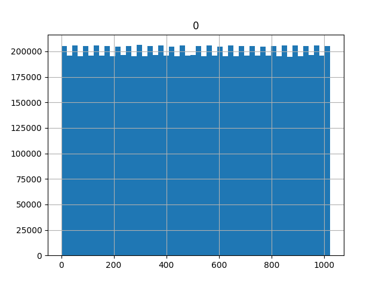

### Using Random Non-Evenly Distributed Data

In Theory this algorithm performs better when the data is created using distributions where
the data is spread out in a non-even manner, unlike the first benchmarks shown. 

#### Normal Gaussian Distribution

This is probably the best distribution to start with, and the one we'll spend 
the most time showcasing.


The algorithm performs optimally here, better
than all the rest, with the exception of Timsort.

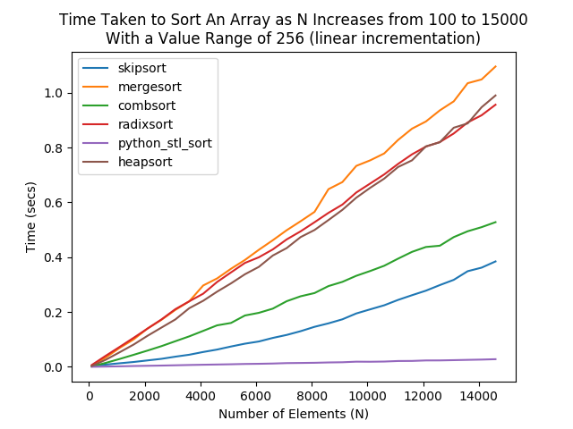


Zooming in on a smaller interval reveals that
the algorithm outperforms all the others
almost immediately, passing CombSort 
at just `N ~= 75`


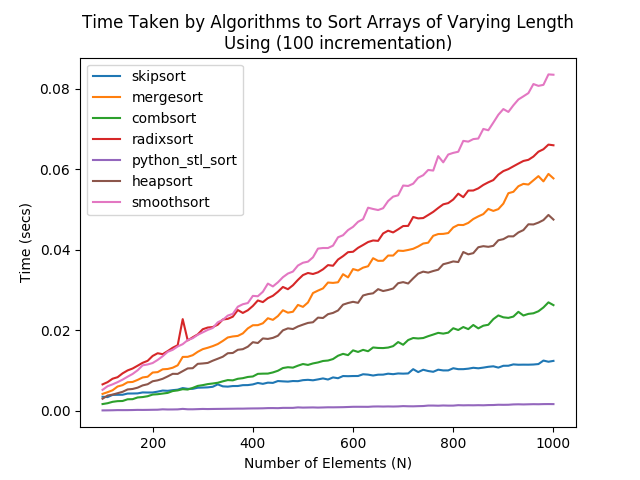


Now when we increase the standard deviation from
`10` to `2000`, we see the performance begin
to average out and become about as good
as radix sort, so we'd obviously need to increase
the size before we see a dramatic increase in 
performance


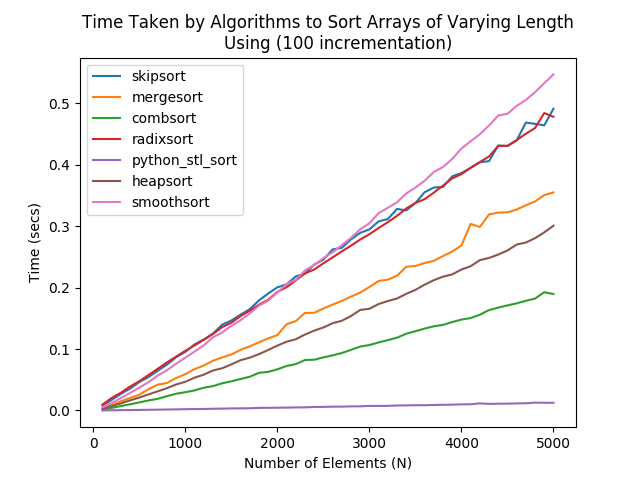

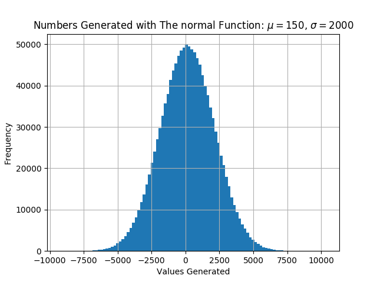


#### Binomial Distributions

This one should come as no surprise, but skipsort easily
takes the lead, which isn't hard to believe considering the 
value range here is hardly 7.


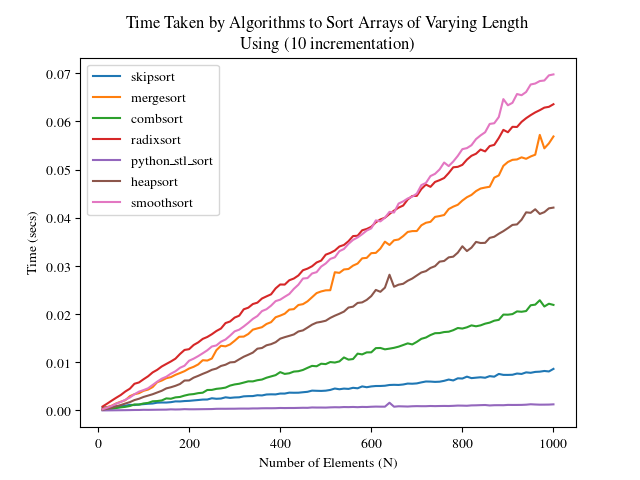


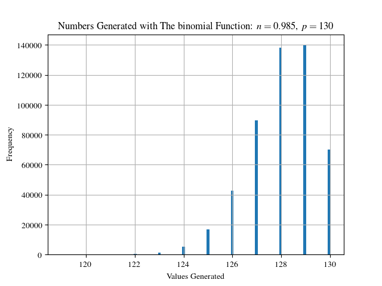

This is basically the same thing


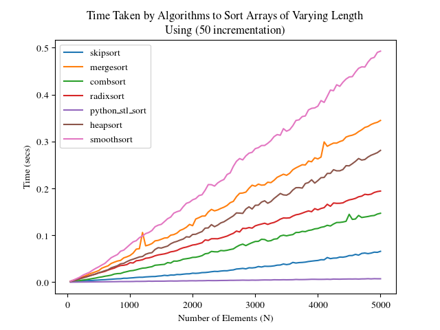

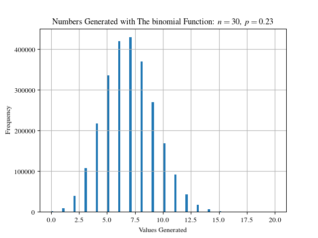

Somehow I don't think we're going to see anything 
we already haven't seen from Binomial Distributions,
so we'll keep moving.

#### Gamma Distribution

Skipsort beats the others since this was a highly concentrated 
distribution.


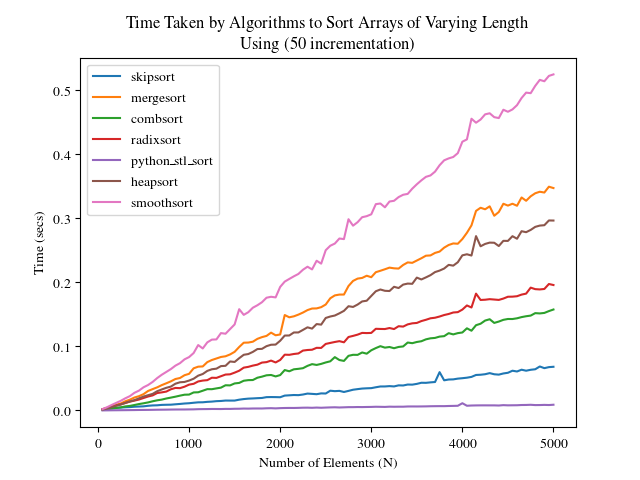


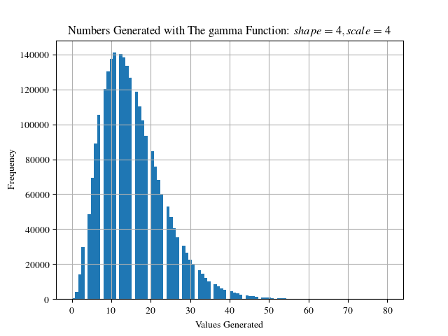


This next is probably the most interesting one of all


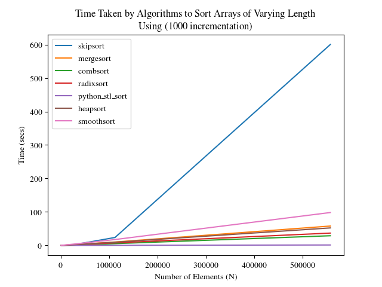

##### N: {1000, 1001, 1006, 1034, 1176, 1888, 5450, 23262, 112324, 557636}

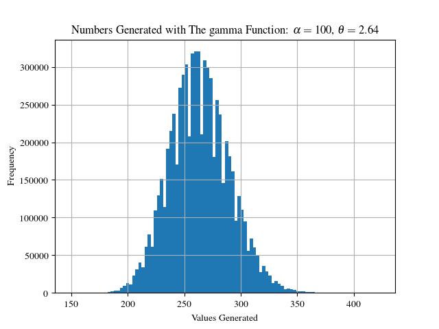

I'm not exactly sure what happened in that case, however it seemed to 
go from being a *very* efficient algorithm, to quickly being 
exponential in time, which is interesting given that, in *theory*, 
it *should* have been able to perform the sort without taking too much
time, all it really needed was to quickly locate and increment the values.
It might be that the lookup time takes far more time than is reasonable.

I will look into this further and determine what causes the slowdown,
and where the majority of the time is being spent.

## Where do we go From Here?
There is still room for further optimization and fine-tuning to this algorithm, namely in the 
searching and inserting space. I've considered using a trie data-structure to reduce it down to 
`O(log log n)` lookup, allowing it to become `O(n)` far quicker, however there is no defined order
to a trie, which makes the process of actually retrieving the data in an ordered and linear fashion, 
rather difficult. 

It's possible to use a hash-table to pre-check whether or not numbers are within the actual skip
list before looking them. This however might be a problem, as the performance of this decreases
very quickly with more and more values, so I can't see it being useful considering it would only
be desirable when we're performing `32` steps just to check whether or not an item is within the skiplist.

It is possible to combine other data structures with the skip list to reduce access times, and so I will
look into that as well. 